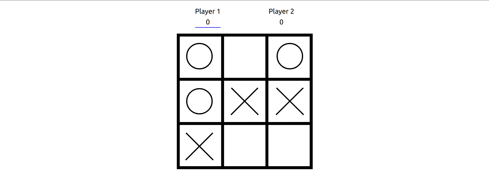

# Tic Tac Toe

## Description

I did a tic tac toe game a long time ago in vanilla javascript. It worked, but it wasn't that pretty and the code was kinda messy. I wanted to redo that project with some nice animated svgs and a more basic styling so it felt more clean, pretty, and responsive. This is the result!  
Instead of using vanilla javascript to manipulate the DOM, I wrote this one in react, and made good use of state and useEffect hooks. I feel a lot better about this one because its pretty and easy to read under the hood as well as in the browser.  
If you want to fiddle with the code, just clone this repo and run npm install.

## Credits

I did this one all by myself, but I would like to give thanks to the react team for writing good documentation

  

